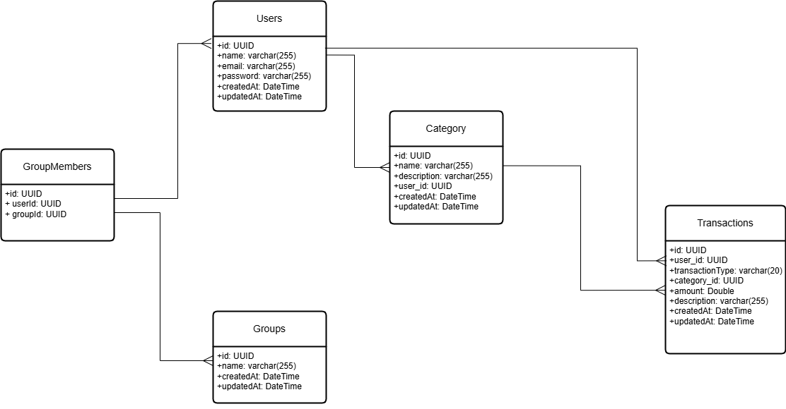

# Expense Tracker API

## Problem Statement

The **Expense Tracker API** is designed to help users manage their personal expenses efficiently. It allows users to perform CRUD operations on their financial data, enabling them to:

1. **Track Transactions**: Record income and expenses with details such as amount, date, and associated category.
2. **Organize by Categories**: Classify transactions into predefined or custom categories like "Groceries," "Rent," or "Utilities."
3. **User Management**: Securely manage user accounts, ensuring each user's financial data is private and protected.
4. **Groups**: Create groups and add users to them for shared expense tracking.

## Key Features

- RESTful API with proper request validation and error handling.
- JWT-based authentication (`Authorization: Bearer <token>` header on all endpoints except `/auth/**`).
- Secure data handling with UUIDs and timestamps for tracking entity creation and updates.
- Scalable architecture using Spring Boot, allowing further enhancements like analytics or reporting in the future.

This API serves as a foundational service for building financial management applications or integrating with larger systems.

**Base URL:** `http://localhost:8080` (all IDs are UUIDs)

----------



### **Auth Endpoints** (public)

1.  **Register User**

    -   **POST** `/auth/register`
    -   Request Body: `{ "name": "John Doe", "email": "john@example.com", "password": "securepassword" }`
        -   `password` must be 8–255 characters.
    -   Response: `{ "token": "<JWT>" }`
2.  **Login User**

    -   **POST** `/auth/login`
    -   Request Body: `{ "email": "john@example.com", "password": "securepassword" }`
    -   Response: `{ "token": "<JWT>" }`

----------

### **User Endpoints**

1.  **Get User Profile**

    -   **GET** `/users/profile`
    -   Headers: `Authorization: Bearer <token>`
    -   Response: `{ "id": "<uuid>", "name": "...", "email": "...", "createdAt": "...", "updatedAt": "..." }`
2.  **Update User Profile**

    -   **PATCH** `/users/profile`
    -   Headers: `Authorization: Bearer <token>`
    -   Request Body (all fields optional): `{ "name": "John Updated", "email": "newemail@example.com", "password": "newpassword" }`
    -   Response: Updated user profile.

----------

### **Transaction Endpoints**

All transaction endpoints require `Authorization: Bearer <token>`.

1.  **Create a Transaction**

    -   **POST** `/transactions`
    -   Request Body:

        ```json
        {
          "transactionType": "Expense",
          "amount": 150.0,
          "description": "Groceries",
          "categoryId": "<category-uuid>"
        }
        ```

        -   `transactionType`, `amount` (positive), and `categoryId` are required.
    -   Response: Created transaction.
2.  **Get All Transactions**

    -   **GET** `/transactions`
    -   Response: List of all transactions belonging to the authenticated user (no filtering supported yet).
3.  **Get a Single Transaction**

    -   **GET** `/transactions/{id}`
    -   Response: Transaction details.
4.  **Update a Transaction**

    -   **PATCH** `/transactions/{id}`
    -   Request Body (all fields optional):

        ```json
        {
          "type": "Expense",
          "categoryId": "<category-uuid>",
          "amount": 200.0,
          "date": "2024-11-30T00:00:00",
          "description": "Updated groceries"
        }
        ```

    -   Response: Updated transaction.
5.  **Delete a Transaction**

    -   **DELETE** `/transactions/{id}`
    -   Response: Empty body on success.

----------

### **Category Endpoints**

All category endpoints require `Authorization: Bearer <token>`.

1.  **Create a Category**

    -   **POST** `/categories`
    -   Request Body: `{ "name": "Food", "description": "Expenses for food and dining" }`
        -   `name` is required; `description` is optional. Both max 255 characters.
    -   Response: Created category.
2.  **Get All Categories**

    -   **GET** `/categories`
    -   Response: List of the authenticated user's categories.
3.  **Update a Category**

    -   **PATCH** `/categories/{id}`
    -   Request Body: `{ "name": "Groceries", "description": "Updated description" }`
    -   Response: Updated category.
4.  **Delete a Category**

    -   **DELETE** `/categories/{id}`
    -   Response: Empty body on success.

----------

### **Group Endpoints**

All group endpoints require `Authorization: Bearer <token>`.

1.  **Create a Group**

    -   **POST** `/groups`
    -   Request Body: `{ "name": "Roommates" }`
    -   Response: Created group.
2.  **Get Group Detail**

    -   **GET** `/groups/{id}`
    -   Response: List of users in the group.
3.  **Add User to Group**

    -   **PUT** `/groups/add-user`
    -   Request Body: `{ "groupId": "<group-uuid>", "userId": "<user-uuid>" }`
    -   Response: `204 No Content`.

----------

### **Planned / Not Yet Implemented**

The following endpoints are planned but not present in the current codebase:

-   Query-parameter filtering on **GET** `/transactions` (`type`, `categoryId`, `startDate`, `endDate`)
-   **GET** `/transactions/summary` — monthly income/expense summary
-   **GET** `/transactions/export` — CSV export of transactions
-   **GET** `/transactions/search` — search transactions by text
